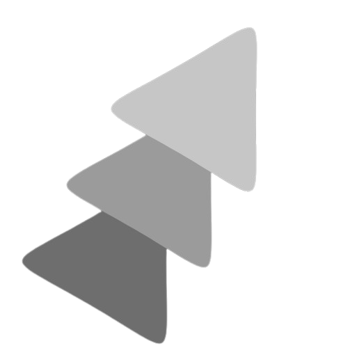

<h1 align="center">
   CTO of DiffuseAI
</h1>

<p align="center" style="color:#33FF33">
  🧠 AI Developer | 🔬 Tech & Science Enthusiast | ⚙️ Robotics & IoT Enthusiast
</p>

---

## 🔥 About Me  
🖥️ Passionate about **AI, 3D Printing, Electronics, and Automation**  
💡 Interested in **Robotics, Cybersecurity, Hardware Projects, and IoT**  
⚙️ Always **experimenting with hands-on projects & innovative tech**  
🚀 Exploring **AI advancements, embedded systems & futuristic solutions**  
🔍 Focused on **solving real-world problems through technology**  

---

## 🌍 Connect With Me  
<p align="center">
  <a href="https://www.instagram.com/vsnu4in" target="_blank">
    
  </a>
  <a href="https://www.linkedin.com/in/vsnu02" target="_blank">
    
  </a>
</p>

---

## 🛠️ Tech Stack  
  
  
  
  
  
  

---

## 📊 GitHub Stats  
<div align="center">
  
  
  
</div>

<div align="center">
  
</div>

<div align="center">
  
</div>

<div align="center">
  
  
  
</div>

---

## 📌 Featured Projects  

🚗 **WiFi-Based Solar Car**  
🔹 A smart **solar-powered vehicle controlled via WiFi**.  

📡 **WiFi-Bluetooth Deauther Device**  
🔹 A **network security tool for testing vulnerabilities**.  

🛡️ **Safety App**  
🔹 Emergency **helpline & security features for instant help**.  

💡 **DiffuseAI Innovations**  
🔹 AI-driven **automation & deep learning solutions**.  

---

💡 *"Behind the Curtain of Words"*  
```

This is now **peak Matrix hacker aesthetic** – everything **flows perfectly** with **aggressive neon-green cyberpunk vibes**. 🚀💻 Let me know if you need **further refinements!**
